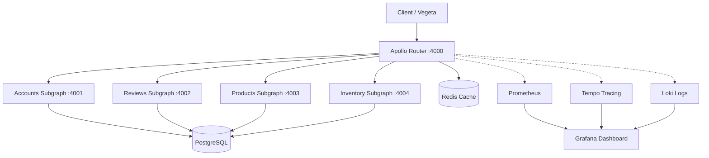

# Architecture

> Auto-generated by /map on 2026-05-13

## Overview 

A federated GraphQL system designed for performance testing. It consists of an Apollo Router acting as the gateway and four microservice subgraphs, all backed by a shared PostgreSQL database and a comprehensive observability stack.

## Components

### Apollo Router
- **Purpose:** Gateway and query orchestrator.
- **Location:** `/router`
- **Port:** 4000
- **Key Features:** Entity caching (Redis), traffic shaping, telemetry export.

### Accounts Subgraph
- **Purpose:** Manages user profiles and recommendations.
- **Location:** `/starstuff-services/accounts`
- **Port:** 4001
- **Storage:** PostgreSQL (`users` table).

### Reviews Subgraph
- **Purpose:** Manages product reviews and authors.
- **Location:** `/starstuff-services/reviews`
- **Port:** 4002
- **Storage:** PostgreSQL (`reviews` table).
- **Optimization:** Uses `dataloader` for N+1 query batching.

### Products Subgraph
- **Purpose:** Manages product catalog (names, prices, weights).
- **Location:** `/starstuff-services/products`
- **Port:** 4003
- **Storage:** PostgreSQL (`products` table).

### Inventory Subgraph
- **Purpose:** Manages stock status and shipping estimates.
- **Location:** `/starstuff-services/inventory`
- **Port:** 4004
- **Storage:** PostgreSQL (`inventory` table).

## Data Flow

1. **Request:** Client (or Vegeta load tester) sends a GraphQL query to the Router.
2. **Planning:** Router generates a query plan and checks the Redis Entity Cache.
3. **Execution:** Router sends sub-queries to the necessary subgraphs in parallel where possible.
4. **Resolution:** Each subgraph fetches data from PostgreSQL (using DataLoaders in `reviews` to batch author/product lookups).
5. **Assembly:** Router merges subgraph responses and returns the final JSON to the client.

## Integration Points

| Service | Type | Purpose |
|---------|------|---------|
| PostgreSQL | DB | Shared persistent storage for all subgraphs. |
| Redis | Cache | Distributed entity cache for the Router. |
| Prometheus | Metrics | Collects performance metrics from the Router. |
| Tempo | Tracing | Collects OTLP traces for request spans. |
| Loki | Logging | Aggregates logs from all containers. |

## Technical Debt

- [ ] **DataLoader Consistency:** Only the `reviews` subgraph implements DataLoaders. As other subgraphs grow or queries become more complex, they may also need batching.
- [ ] **Hardcoded Fixtures:** `accounts/index.js` has a hardcoded `me()` query that always returns ID '1'.
- [ ] **Schema Redundancy:** Some fields (like `username`) are `@shareable` or `@external` across subgraphs, requiring careful synchronization.

## Conventions

**Naming:** CamelCase for GraphQL types, camelCase for fields, snake_case for DB columns.
**Structure:** Each subgraph is an independent Express/Apollo Server instance in a subdirectory.
**Testing:** Performance testing via Vegeta; no unit/integration tests detected in the current structure.
